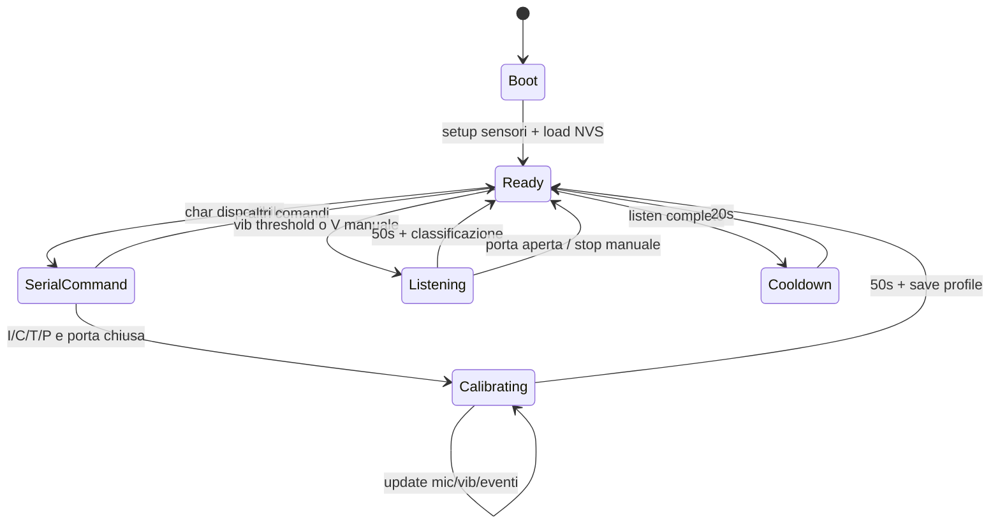
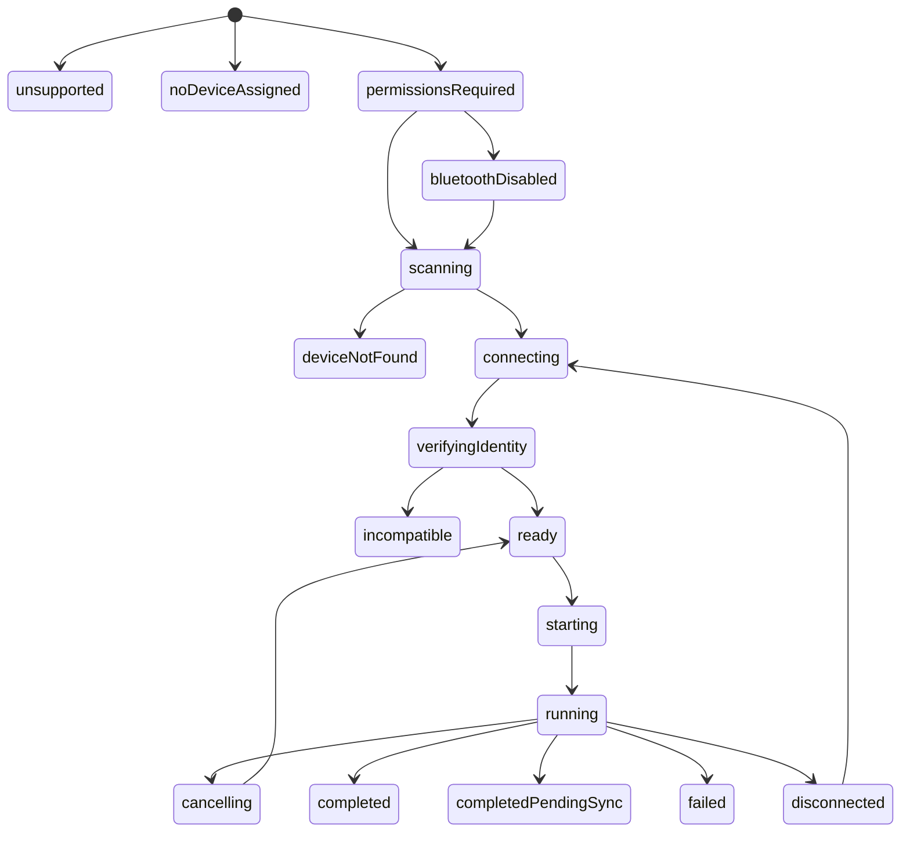
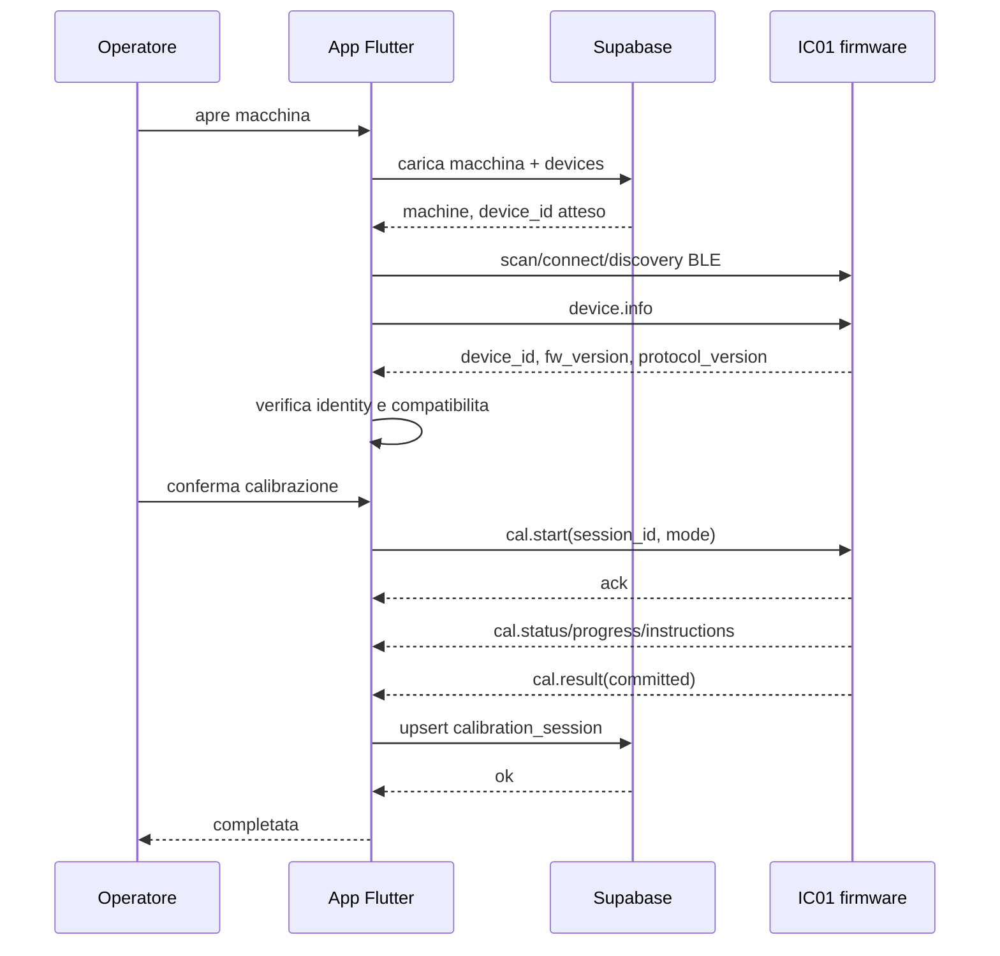

# Audit calibrazione BLE IC01

Data audit: 2026-08-06. Obiettivo: specifica implementativa per collegare la
calibrazione firmware all'app Flutter via BLE, senza implementare il flusso e
senza modificare firmware o database remoto.

## 1. Repository e baseline

| Area | Percorso | Branch | HEAD/stato |
|---|---|---|---|
| App Flutter/Supabase | `/Users/massimilianoiannucci/Documents/magma/ic01-operator-app` | `newMachine_Calibration` | `0c86a4ab1911ae9246370011299ee962769d11bd`, clean all'inizio |
| Firmware protetto | `/Users/massimilianoiannucci/Documents/magma/ic-01-firwmare` | `main` | `54f93a5a176f2523235ac130f238b83705d9aa79`, clean all'inizio |
| App esterna omonima | `/Users/massimilianoiannucci/Documents/ic01-operator-app` | `main` | `93221f83b0b8758948bf28555330905230fab5ed`, modifiche preesistenti in `lib/features/dashboard/presentation/dashboard_page.dart` |
| Flutter SDK checkout | `/Users/massimilianoiannucci/Documents/flutter` | `stable` | `b45fa18946ecc2d9b4009952c636ba7e2ffbb787`, ahead 28/behind 2835 |

Firmware trattato come read-only. Nel repo firmware erano gia' presenti
directory ignorate `.pio/` e `.vscode/`; non sono state eseguite build, clean,
flash o script.

## 2. Architettura firmware attuale

Firmware ESP32 Arduino PlatformIO (`platformio.ini`) con:

- loop cooperativo in `src/main.cpp` ogni `kSensorUpdateIntervalMs = 75 ms`;
- sensori: LDR su ADC, INMP441 via I2S, MPU6050 via I2C;
- Wi-Fi station per telemetria/comandi HTTP manuali;
- persistenza NVS via `Preferences`;
- comandi seriali a 460800 baud.

File principali:

- `src/main.cpp`: orchestrazione, seriale, telemetria, stato porta, vibrazione,
  classificazione, completamento calibrazione.
- `src/config.h`: pin, frequenze, timeout, URL Supabase, `kDeviceId`,
  `kDeviceSecret`, versioni.
- `src/sensors/MicSensor.cpp/.h`: I2S, feature extraction, profili mic,
  calibrazione mic.
- `src/sensors/AccelSensor.cpp/.h`: MPU6050 accelerometro/giroscopio.
- `src/sensors/LightSensor.cpp/.h`: LDR porta.

## 3. Calibrazione attuale

Entry point: `handleSerialCommands()` in `src/main.cpp:1023`.

Comandi:

| Comando | Azione |
|---|---|
| `I` | calibra profilo idle |
| `C` | calibra coffee |
| `T` | calibra cappuccino |
| `P` | calibra powders |
| `B` | salva valore LDR porta chiusa |
| `N` | salva valore LDR porta aperta |
| `R` | stampa stato LDR |
| `X` | reset calibrazione LDR |
| `L` | lista profili mic |
| `D` | cancella profili mic |
| `V` | avvio/stop manuale listening |
| `S/O` | stream CSV mic on/off |
| `W/Q` | telemetria/poll comandi via Wi-Fi |

La calibrazione mic parte con `MicSensor::startCalibration()` e dura
`kMicCalibDurationMs = 50000`. `MicSensor::update()` accumula feature a ogni
finestra I2S e divide la finestra in 3 segmenti. Al termine salva il profilo in
NVS e segnala `calibComplete_`; il main loop raccoglie vibrazione/event pattern,
salva profilo vibrazione e soglia.

La procedura e' asincrona e non bloccante rispetto al main loop: il comando
seriale imposta lo stato, poi `loop()` continua a campionare e completa la
sessione quando il tempo scade. Non gira in task dedicato. La calibrazione e'
indipendente dal Wi-Fi, salvo i comandi `W/Q` non correlati.

Guardrail presenti:

- porta aperta blocca avvio calibrazione;
- porta aperta ferma listening attivo;
- calibrazione automatica/listening bloccati se mancano profili richiesti;
- IMU mancante viene loggata e impedisce raccolta vib se assente.

Limiti:

- nessun cancel strutturato per calibrazione in corso;
- nessun progresso interrogabile;
- nessun risultato machine-readable;
- nessun session id;
- nessun timeout/errore strutturato oltre ai log seriali.

## 4. Feature extraction e detection erogazioni

Mic:

- I2S sample rate `16000 Hz`, `512` frame per finestra, circa 32 ms;
- RMS, peak, zero crossing rate;
- bande Goertzel centrate a 120, 600, 2000, 3500, 5000 Hz con bandwidth 80 Hz;
- feature derivate `band21`, `band32`, `band53`, `rmsDelta`;
- 3 segmenti start/mid/end;
- event pattern fino a 3 eventi, classificati low/mid/high per banda dominante.

Vibrazione:

- MPU6050 accel + gyro;
- `vibAccel = |mag - 1g|`;
- `vibGyro = sqrt(gx^2 + gy^2 + gz^2)`;
- score `kVibWeightAccel * vibAccel + kVibWeightGyro * vibGyro`;
- EMA con `kVibEmaAlpha = 0.1`;
- trigger se score EMA supera soglia e holdoff 5000 ms.

Listening/classificazione:

- finestra `kMicListenDurationMs = 50000`;
- cooldown `kMicListenCooldownMs = 20000`;
- distanza Naive Bayes style su feature, segmenti, pattern eventi e vibrazione;
- confidence = differenza tra primo e secondo score;
- sotto `kMicMinConfidence = 0.5` viene classificato `UNKNOWN`.

## 5. Hot/cold

Nel firmware non esiste una distinzione `hot`/`cold`. Esistono profili:

- `kProfileIdle`;
- `kProfileCoffee`;
- `kProfileCappuccino`;
- `kProfilePowders`.

Per `hot` il mapping piu' naturale, da confermare, e' idle + profili bevande
calde. Per `cold` non c'e' supporto esplicito: nessun profilo impatto, caduta
bottiglia/lattina, finestra breve o feature specifica. L'app dovra' derivare il
tipo da `machines.temperature_mode`, ma il firmware deve dichiarare quali mode
supporta (`FW-GAP-007`).

## 6. Persistenza attuale

Persistenza NVS:

| Dato | Namespace/key | Codice |
|---|---|---|
| profili mic | `mic_profiles` / `p0..p3` | `MicSensor::loadProfiles_()`, `saveProfile_()` |
| eventi profilo mic | stesso profilo | `MicSensor::setProfileEvents()` |
| profili vib | `vib_profiles` / `v0..v3` | `loadVibProfiles()`, `saveVibProfile()` |
| soglia vib | `vib_profiles` / `th_valid`, `th` | `saveVibThreshold()` |
| LDR | `ldr_cal` | `loadLdrCalibration()`, `saveLdrCalibration()` |
| prodotti | `device_cfg` / `products` | `loadProductConfig()`, `applyProductConfig()` |

La vecchia calibrazione resta in memoria/NVS durante i 50s di raccolta perche'
il profilo viene scritto al termine. Tuttavia manca garanzia atomica complessiva
mic + vib + threshold: il mic profile puo' essere salvato prima di event pattern
e vib profile; non risultano schema version, checksum, rollback o validazione
strutturata (`FW-GAP-005`).

## 7. Bluetooth attuale

BLE assente. Non sono stati trovati:

- Bluetooth Classic;
- BLE/NimBLE/ArduinoBLE/ESP-IDF GATT;
- advertising;
- pairing/bonding;
- service/characteristic UUID;
- provisioning/manutenzione via Bluetooth.

Primitive necessarie e stato:

| Primitiva | Stato firmware |
|---|---|
| identificare device | presente solo via costante/HTTP, non BLE |
| avviare calibrazione | seriale, non BLE |
| annullare calibrazione | assente |
| leggere stato | log seriale, non strutturato |
| notifiche | assenti |
| risultato | log seriale, non strutturato |
| firmware/protocol version | `kFirmwareVersion`, protocol version assente |

## 8. Device identity

Firmware:

- `kDeviceId = "ic01-esp32-001"` in `src/config.h`;
- `kDeviceSecret` hardcoded in `src/config.h`;
- firmware version `0.1.0`;
- nessun serial number/efuse MAC/BLE address usato come identity applicativa;
- nessun advertising name perche' BLE assente.

Backend remoto `ic01-dev`:

- `public.devices.device_id text unique not null`;
- `public.devices.machine_id uuid references public.machines(id)`;
- `public.machines.hw_serial text nullable`, ma non e' il join primario device;
- al momento `devices` ha 0 righe remote.

Identity corretta proposta: l'app deve leggere `device_id` via BLE e confrontarlo
con `public.devices.device_id` della riga associata alla macchina. Non usare
MAC BLE randomizzabile. Non usare `machines.code`.

## 9. Sicurezza attuale

Firmware e Edge Function usano HMAC-SHA256:

- header `x-device-id`;
- header `x-timestamp`;
- header `x-signature = HMAC(secret, timestamp.body)`;
- secret primario e `device_secret_next` lato backend.

Rischi rilevati:

- `kWifiPassword` e `kDeviceSecret` sono hardcoded nel firmware;
- i secret non devono essere copiati in Flutter;
- non esiste sicurezza BLE;
- non esiste maintenance window fisica;
- remote schema `ic01-dev` ha RLS disabilitata su `devices`, `device_status`,
  `device_commands`, `dispense_events`, `firmware_versions`, ecc. Il connector
  Supabase lo segnala come advisory critico. Non e' stata applicata alcuna
  remediation.

Trust model minimo pilot:

- app autentica utente via Supabase e verifica accesso a macchina;
- app legge device identity via BLE e la confronta con `devices`;
- firmware accetta comandi BLE solo in finestra maintenance fisica o modalita'
  locale chiaramente abilitata;
- nessun secret passa via BLE.

Trust model industrializzazione:

- LE Secure Connections + bonding;
- provisioning device per lotto, secret non hardcoded;
- rotazione secret backend;
- audit backend di sessioni con RLS;
- test di reset pairing/revoca.

## 10. Architettura Flutter

App Flutter con:

- Riverpod disponibile (`ProviderScope` in `main.dart`), ma molte schermate sono
  ancora StatefulWidget con chiamate dirette a Supabase;
- GoRouter;
- Supabase Flutter;
- `shared_preferences` e `connectivity_plus`;
- notifiche Firebase/locali;
- nessuna dipendenza BLE presente in `pubspec.yaml`.

Schermate rilevanti:

- operatore: `lib/features/machines/presentation/machine_detail_page.dart`;
- admin: `lib/features/admin/presentation/admin_machine_config_page.dart`;
- onboarding: `lib/features/onboarding/data/customer_machine_onboarding_service.dart`.

Futura architettura consigliata:

- `BleTransport`: scan/connect/discover/read/write/notify astratti;
- `DeviceDiscoveryService`: filtra servizio IC01 e identity;
- `CalibrationRepository`: coordina BLE + Supabase + cache locale;
- `CalibrationController`: Riverpod `Notifier`/`AsyncNotifier` coerente con app;
- widget solo UI, senza logica BLE diretta.

Libreria BLE raccomandata, da non aggiungere ora: `flutter_blue_plus`, per
supporto Android/iOS, scan, connect, discovery GATT e notification consolidate.
Da verificare nella fase implementativa contro versioni correnti e permessi.

## 11. Android, iOS e altre piattaforme

Android:

- `minSdk`, `targetSdk`, `compileSdk` usano valori Flutter in
  `android/app/build.gradle.kts`;
- `AndroidManifest.xml` contiene solo `POST_NOTIFICATIONS`;
- mancano `BLUETOOTH_SCAN`, `BLUETOOTH_CONNECT`, `BLUETOOTH_ADVERTISE` se
  necessario, `ACCESS_FINE_LOCATION` per Android <= 11 secondo libreria scelta;
- permessi runtime non implementati.

iOS:

- deployment target 13.0 in Xcode project;
- `Info.plist` non contiene `NSBluetoothAlwaysUsageDescription`;
- background modes non configurati e non necessari per calibrazione foreground.

Web/macOS/Windows/Linux:

- app compila per piu' piattaforme, ma il flusso BLE di calibrazione deve essere
  mobile-only;
- dashboard web puo' mostrare stato/storico Supabase, non connettersi via BLE.

## 12. Backend esistente

Schema remoto `ic01-dev` confermato via connector Supabase:

- `machines`, `sites`, `clients`, `machine_consumables`;
- `devices(device_id unique, device_secret, device_secret_next, machine_id)`;
- `device_status`;
- `device_commands`;
- `dispense_events`;
- `firmware_versions`;
- nessuna `calibration_sessions`.

Edge Functions:

- `device_telemetry_products`: valida HMAC e scala `machine_consumables` in base
  a `machines.temperature_mode`;
- `device_commands`: polling device HMAC per comandi remoti, supporto attuale
  firmware a `set_products`;
- `places_autocomplete`, notifiche, public ticket.

Raccomandazione backend: creare in fase successiva una tabella
`calibration_sessions` separata da `device_commands`, con RLS per utente
autorizzato alla macchina e unique su `session_id`/`device_id` per idempotenza.

Campi consigliati:

| Campo | Scopo |
|---|---|
| `id uuid` | PK |
| `session_id text unique` | idempotenza app/device |
| `machine_id uuid` | macchina |
| `device_id uuid` | FK a `devices.id` |
| `operator_id uuid` | utente |
| `temperature_mode text` | hot/cold |
| `status text` | completed/failed/cancelled/pending_sync |
| `started_at`, `completed_at` | audit |
| `fw_version`, `protocol_version` | compatibilita' |
| `result jsonb`, `error jsonb` | payload |
| `synced_at`, `created_offline_at` | offline |

## 13. Contratto BLE proposto

Proposta, non implementata e da concordare con firmware team.

Scelta: singolo servizio IC01 con message protocol JSON compatto. E' meno
complesso di molte characteristic specifiche e mantiene idempotenza/reconnect.

UUID proposti:

| Elemento | UUID proposto | Proprieta |
|---|---|---|
| IC01 service | `9b7e0001-5a3c-4f3b-9d0e-1c0100000001` | primary service |
| Info | `9b7e0002-5a3c-4f3b-9d0e-1c0100000001` | read |
| Control | `9b7e0003-5a3c-4f3b-9d0e-1c0100000001` | write with response |
| Events | `9b7e0004-5a3c-4f3b-9d0e-1c0100000001` | notify, prefer indicate per finali |

Encoding:

- UTF-8 JSON;
- little-endian non rilevante se JSON;
- payload massimo consigliato <= 180 byte per evitare chunking con MTU base;
- per risultati grandi: chunk `{chunk_index, chunk_count, total_len, crc32}`.

Envelope:

```json
{
  "v": 1,
  "type": "cmd|ack|event|result|error",
  "cmd": "cal.start",
  "request_id": "uuid",
  "session_id": "uuid",
  "seq": 12,
  "payload": {}
}
```

Comandi:

| Command ID | Direction | Payload | Risposta |
|---|---|---|---|
| `device.info` | app -> device | `{}` | identity/capabilities |
| `cal.status` | app -> device | `{session_id?}` | stato corrente |
| `cal.start` | app -> device | `{mode, profile_set}` | ack + eventi |
| `cal.cancel` | app -> device | `{session_id}` | ack + cancelled |
| `cal.result` | app -> device | `{session_id}` | risultato finale |

Esempio `device.info`:

```json
{
  "device_id": "ic01-esp32-001",
  "fw_version": "0.1.0",
  "protocol_version": "1.0.0",
  "capabilities": {
    "calibration_modes": ["hot"],
    "cancel": true,
    "reconnect_status": true
  }
}
```

Errori standard:

| Codice | Retry | Significato |
|---|---:|---|
| `unauthorized` | no | BLE non abilitato/autorizzato |
| `unsupported_mode` | no | hot/cold non supportato |
| `busy` | si | sessione gia' in corso |
| `door_open` | si | porta aperta |
| `imu_missing` | si/no | IMU non rilevata |
| `mic_read_failed` | si | I2S non produce campioni |
| `storage_error` | si/no | NVS non salva |
| `timeout` | si | sessione scaduta |
| `invalid_payload` | no | JSON/comando non valido |

Timeout/retry:

- scan app: 15-30s;
- connect/discovery: 10s;
- ack comando: 3s, retry con stesso `request_id`;
- calibrazione hot attuale: almeno 4 finestre da 50s se si calibra idle +
  coffee + cappuccino + powders; aggiungere margine operatore;
- reconnect: app rilegge `cal.status` e riprende da `session_id`.

Idempotenza:

- `request_id` identifica ogni comando;
- `session_id` identifica la sessione end-to-end;
- duplicato `cal.start` con stesso `session_id` deve restituire stato corrente,
  non avviare una seconda calibrazione.

## 14. Macchina a stati firmware attuale

La macchina a stati attuale e' ricostruita dal codice, non formalizzata nel
firmware.



Transizioni invalide attuali solo implicitamente:

- avvio calibrazione se porta aperta -> log e resta ready;
- listening senza profili -> log e resta ready;
- trigger vib durante calibrazione -> ignorato.

## 15. Macchina a stati Flutter proposta



Responsabilita' Flutter:

- autorizzazione utente e accesso macchina;
- permessi Bluetooth runtime;
- scan/connect/discovery;
- verifica `device_id`;
- UI istruzioni e progresso;
- cache locale se Supabase offline;
- sync idempotente.

Responsabilita' firmware:

- advertising/GATT;
- identity/protocol version;
- session state;
- calibrazione e persistenza atomica;
- notifiche/errori;
- recovery dopo reconnect.

## 16. Flusso operativo reale/proposto

| Step | Attore | Comando/azione | Disponibilita firmware | Gap |
|---|---|---|---|---|
| Apri schermata macchina | app | query `machine_effective_consumables` + futuro `devices` | app presente, query devices da aggiungere | - |
| Verifica device associato | app/backend | `devices.machine_id = machine.id` | schema presente, dati assenti | FW-GAP-010 |
| Permessi Bluetooth | app | runtime permissions | non implementato app | - |
| Scan IC01 | app/device | advertising service | assente | FW-GAP-001 |
| Connessione/discovery | app/device | GATT | assente | FW-GAP-001 |
| Leggi identity | app/device | `device.info` | assente | FW-GAP-003 |
| Verifica hot/cold | app/device | capabilities | assente | FW-GAP-007 |
| Conferma operatore | app | UI | da implementare | - |
| Avvia calibrazione | app/device | `cal.start` | seriale solo | FW-GAP-002 |
| Istruzioni/progresso | device/app | `cal.status` events | log seriale solo | FW-GAP-004 |
| Acquisizione eventi | firmware | algoritmo esistente | presente | - |
| Salvataggio atomico | firmware | commit profili | parziale | FW-GAP-005 |
| Risultato | device/app | `cal.result` | log seriale solo | FW-GAP-009 |
| Sync backend | app/backend | insert `calibration_sessions` | tabella assente | software/backend |
| Reconnect/retry | app/device | `cal.status` | assente | FW-GAP-004 |

## 17. Offline

Requisito: calibrazione e salvataggio firmware devono funzionare senza Wi-Fi sul
device. Questo e' coerente con il codice attuale: calibrazione usa sensori e NVS,
non Supabase. Wi-Fi serve solo per `W/Q`.

Telefono senza Internet:

- l'app esegue BLE e riceve `cal.result`;
- salva localmente sessione e risultato con `session_id`;
- mostra "Calibrazione completata, sincronizzazione in attesa";
- quando torna online, upsert/insert idempotente su Supabase;
- unique su `session_id` evita duplicati.

Il progetto ha `shared_preferences` e `connectivity_plus`, ma non ha una coda
offline generale per operazioni strutturate. Per produzione usare storage locale
piu' robusto di shared preferences se i payload crescono.

## 18. Piano implementazione software

| Step | Stato | File probabili | Dipendenze | Rischio | Test | Accettazione |
|---|---|---|---|---|---|---|
| Protocollo Dart condiviso | implementabile con mock | `lib/features/calibration/domain/*` | decisione contratto | medio | unit | encoding/decoding/errori |
| Config Android/iOS | implementabile subito | manifest, Info.plist | libreria BLE | medio | build mobile | permessi richiesti |
| `BleTransport` | implementabile con mock | `lib/core/ble/*` | FW-GAP-001 per hardware | alto | mock + device | scan/connect/discovery |
| Discovery identity | bloccato da firmware | `DeviceDiscoveryService` | FW-GAP-003 | alto | mock + hardware | rifiuta mismatch |
| Repository calibrazione | implementabile con mock | `CalibrationRepository` | FW-GAP-002/004/009 | alto | unit | sessioni idempotenti |
| State management | implementabile con mock | Riverpod controller | repository | medio | widget/unit | stati UI corretti |
| UI operatore macchina | implementabile con mock | `machine_detail_page.dart` o feature dedicata | controller | medio | widget | flusso guidato |
| UI admin storico | implementabile dopo backend | admin pages | tabella sessioni | medio | widget | storico visibile |
| Supabase modello sessioni | implementabile subito in migration futura | `supabase/migrations/*` | decisione schema/RLS | alto | SQL | RLS e unique |
| Coda offline | implementabile con mock | local data source | schema sessioni | alto | unit | sync senza duplicati |
| Test hardware e2e | verificabile solo su hardware | checklist | tutti i blocker | alto | manuale | sessione completa |

## 19. Diagramma sequenza



## 20. Tracciabilita stati Flutter/BLE/gap

| Stato Flutter | Messaggio BLE | Gap firmware |
|---|---|---|
| `unsupported` | capabilities assenti/incompatibili | FW-GAP-001, FW-GAP-007 |
| `noDeviceAssigned` | nessuno, query backend | FW-GAP-010 |
| `permissionsRequired` | nessuno | software |
| `scanning` | advertising service | FW-GAP-001 |
| `connecting` | GATT connect | FW-GAP-001 |
| `verifyingIdentity` | `device.info` | FW-GAP-003 |
| `incompatible` | capabilities/protocol | FW-GAP-007 |
| `ready` | `cal.status` idle/ready | FW-GAP-004 |
| `starting` | `cal.start` | FW-GAP-002 |
| `running` | `cal.status` notify | FW-GAP-004 |
| `cancelling` | `cal.cancel` | FW-GAP-002 |
| `completed` | `cal.result` | FW-GAP-005, FW-GAP-009 |
| `completedPendingSync` | local result cached | software/backend |
| `failed` | `cal.error` | FW-GAP-011 |
| `disconnected` | reconnect + `cal.status` | FW-GAP-004 |

## 21. Test necessari

Flutter:

- unit protocol codec e mapping errori;
- unit identity verification;
- controller state transitions;
- widget su mobile layout;
- offline queue e idempotenza;
- integration con fake BLE transport.

SQL:

- `calibration_sessions` RLS per admin/technician/operator assegnato;
- unique `session_id`;
- insert/update sync offline;
- divieto anon e cross-tenant.

Hardware:

- scan/connect Android e iOS;
- identity match/mismatch;
- hot calibration completa;
- cold support o errore strutturato;
- porta aperta;
- reboot/reconnect;
- power loss durante save;
- telefono offline.

## 22. Rischi e decisioni aperte

Rischi:

- coesistenza BLE/Wi-Fi/I2S su ESP32;
- RLS device disabilitata in dev;
- secret hardcoded in firmware;
- cold non definito;
- persistenza profili non atomica;
- parsing log seriale da evitare.

Decisioni aperte:

- UUID definitivi;
- JSON vs CBOR;
- libreria BLE firmware;
- maintenance window fisica;
- mapping hot/cold e istruzioni operatore;
- schema `calibration_sessions`;
- livello security pilot vs industrializzazione.

## 23. Verifiche eseguite

- Lettura firmware read-only con `rg`, `sed`, `git status`, `git diff`.
- Introspezione Supabase `ic01-dev` via connector: lista progetti, lista tabelle
  public verbose, policy e funzioni.
- Tentativo `supabase migration list`: fallito prima della connessione per
  `failed to parse environment file: .env.local`; nessuna migration remota o
  DDL eseguita.
- Nessun database remoto modificato.
- Produzione non modificata.
