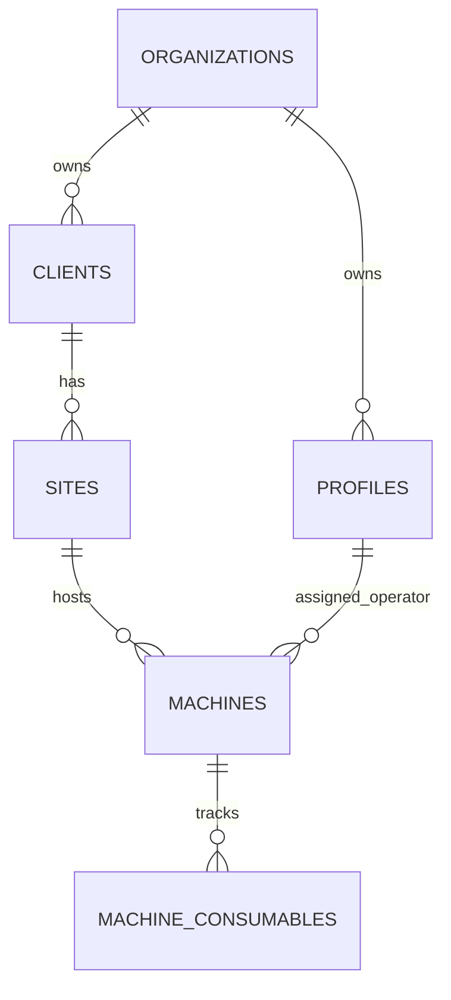

# Customer and machine onboarding

## Obiettivo

Questa feature introduce la prima parte dell'onboarding operativo:

- creazione di un cliente con la prima sede;
- aggiunta di sedi successive;
- creazione di una macchina installata in una sede;
- associazione macchina -> sede -> cliente.

La calibrazione Bluetooth/BLE non e' inclusa.

## Ruoli autorizzati

Le RPC di onboarding accettano solo utenti autenticati con ruolo:

- `admin`;
- `refill_operator`.

Il ruolo `technician` mantiene l'accesso ai flussi manutenzione esistenti ma non
puo' creare clienti, sedi o macchine tramite queste RPC.

## Modello dati

Il progetto aveva gia' il modello necessario:



Tabelle principali:

- `clients`: cliente finale. Campi esistenti principali: `id`, `name`,
  `vat_number`, `notes`, `created_at`. La migration aggiunge `created_by` e
  `updated_at`; la hardening migration aggiunge `organization_id not null`.
- `sites`: sede fisica del cliente. Campi esistenti principali: `id`,
  `client_id`, `name`, `address`, `city`, `lat`, `lon`, `created_at`. La
  migration aggiunge `created_by` e `updated_at`; la hardening migration
  aggiunge `organization_id not null`.
- `machines`: macchina installata in una sede. Campi obbligatori rilevati:
  `code`, `site_id`, `assigned_operator_id`, `temperature_mode`. Campi
  esistenti utili: `current_fill_percent`, `yearly_shots`, `hw_serial`,
  `capacity_water_ml`, `created_at`, `updated_at`. La hardening migration
  aggiunge `created_by` e `organization_id not null`.
- `machine_consumables`: capacita' e stato dei fattori monitorati. Campi
  principali: `machine_id`, `type`, `capacity_units`, `current_units`,
  `is_enabled`.

Durante l'hardening e' stato introdotto un tenant esplicito con
`organizations` e `organization_id` su `profiles`, `clients`, `sites` e
`machines`. Le RPC derivano sempre l'organizzazione da `auth.uid()` tramite il
profilo; il client non puo' inviare o falsificare `organization_id`.

## Flusso cliente

Il form "Nuovo cliente" richiede:

- nome cliente;
- indirizzo sede principale;
- nome sede opzionale.

La creazione usa la RPC transazionale
`create_client_with_primary_site(p_client_name, p_site_address, p_site_name)`.
Se l'inserimento della sede fallisce, non rimane un cliente senza sede.

Se il nome sede non viene inserito, viene usata l'etichetta `Sede principale`.

## Gestione sedi

La pagina dettaglio cliente permette di aggiungere una sede con la RPC
`add_site_to_client(p_client_id, p_site_address, p_site_name)`.

La RPC valida lato database:

- utente autenticato;
- ruolo `admin` o `refill_operator`;
- cliente esistente;
- indirizzo non vuoto;
- accesso al cliente per admin, creatore del cliente o operatore assegnato a una
  macchina del cliente, sempre entro la stessa organizzazione.

L'accesso basato su `created_by` non e' permanente: serve a far vedere a un
operatore il cliente/sede appena creato finche' non esiste ancora una macchina
per quel cliente. Quando il cliente ha macchine, la visibilita' dell'operatore
dipende dalle assegnazioni effettive.

## Flusso macchina

Il form "Nuova macchina" richiede:

- cliente;
- sede;
- tipo macchina;
- capacita' dosi monitorate;
- codice macchina;
- operatore assegnatario, solo per admin;
- seriale hardware opzionale.

La creazione usa la RPC
`create_machine_for_site(p_client_id, p_site_id, p_code, p_temperature_mode,
p_capacity_units, p_assigned_operator_id, p_hw_serial)`.

La RPC garantisce lato database che:

- la sede appartenga al cliente selezionato;
- `temperature_mode` sia `hot` o `cold`;
- la capacita' sia un intero positivo;
- il codice macchina non sia vuoto e rispetti l'unicita' normalizzata gia'
  presente tramite `normalize_machine_code(code)`;
- l'assegnatario sia un `refill_operator`;
- l'assegnatario appartenga alla stessa organizzazione dell'admin;
- un operatore non possa creare macchine assegnandole ad altri.

Per gli operatori, `assigned_operator_id` viene forzato a `auth.uid()`. Per gli
admin, il form richiede la selezione di un operatore refill.

## Codice macchina

`machines.code` e' obbligatorio (`not null`) e non ha un default o generatore
nel database. Il codice viene quindi inserito manualmente dal form "Nuova
macchina".

Regole rilevate:

- normalizzazione database: `normalize_machine_code(code)` usa `upper`,
  `trim` e rimuove spazi/trattini;
- unicita': indice unico parziale su `normalize_machine_code(code)` quando il
  codice non e' vuoto;
- uso pubblico: il flusso `/segnalazione` usa lo stesso codice normalizzato per
  trovare la macchina;
- non e' il `device_id`, il MAC address o il seriale hardware;
- il seriale hardware resta nel campo opzionale `hw_serial`;
- il collegamento hardware futuro resta su `devices.machine_id`.

La RPC `create_machine_for_site` valida codice non vuoto e intercetta
`unique_violation`, restituendo errore se il codice e' gia' in uso.

## Assegnazione operatore

`machines.assigned_operator_id` e' obbligatorio.

Creazione da operatore:

- l'operatore non puo' scegliere l'assegnatario;
- la RPC forza `assigned_operator_id = auth.uid()`;
- eventuali valori inviati dal client in `p_assigned_operator_id` vengono
  ignorati.

Creazione da admin:

- l'admin deve selezionare un operatore refill;
- non esiste un operatore predefinito;
- non e' consentita una macchina non assegnata;
- la RPC verifica che l'operatore scelto abbia ruolo `refill_operator` e la
  stessa `organization_id` dell'admin.

## Tipo macchina

La tabella `machines` aveva gia' il campo `temperature_mode` con check:

- `hot`;
- `cold`.

La UI mostra le label italiane "Caldo" e "Freddo", ma il database conserva i
valori stabili `hot` e `cold`.

## Capacita' dosi monitorate

Audit effettuato:

- `machines.capacity_water_ml` esiste gia', ma rappresenta una capacita' acqua e
  non viene usato dalle view operative del refill a dosi.
- `machine_consumables.capacity_units` esiste gia' ed e' usato da
  `client_states`, `machine_states`, `machine_effective_consumables`,
  `AdminMachineConfigPage`, `MachineDetailPage` e dalla Edge Function
  `device_telemetry_products`.

`machine_consumables.capacity_units` e' un dato per-consumabile/per-fattore, non
una capacita' totale generica della macchina. Nel modello attuale l'app e le
Edge Function monitorano un solo fattore attivo coerente con
`machines.temperature_mode`:

- macchina `hot` -> consumabile/fattore `hot`;
- macchina `cold` -> consumabile/fattore `cold`.

Il form non la presenta piu' come capacita' totale, ma come "Capacita' dosi
monitorate". La RPC crea il record `machine_consumables` solo per il fattore
attivo `hot` o `cold`, con `capacity_units = current_units = valore inserito`.

Se in futuro si dovranno modellare prodotti freddi multipli, ingredienti hot
separati o capacita' per selezione, la configurazione dovra' passare dal
backoffice consumabili/macchina o da un modello prodotto dedicato, non da questo
campo generico.

## RLS e autorizzazioni

Migration deployabile introdotta e applicata su `ic01-dev`:

- `20260803150129_deploy_customer_machine_onboarding_ic01_dev.sql`

Fixture di validazione locale, non deployabili:

- `supabase/fixtures/onboarding_validation/20260724090000_core_schema_baseline.sql`
- `supabase/fixtures/onboarding_validation/20260803120000_customer_machine_onboarding.sql`
- `supabase/fixtures/onboarding_validation/20260803130000_customer_machine_onboarding_hardening.sql`

Modifiche principali:

- tiene una baseline idempotente dello schema core solo come fixture per
  validare da zero su database disposable;
- aggiunge audit `created_by`/`updated_at` su clienti e sedi;
- aggiunge `created_by` su macchine;
- aggiunge `organizations` e `organization_id not null` su profili, clienti,
  sedi e macchine;
- aggiunge trigger `updated_at` per `clients`, `sites`, `machines`;
- aggiunge RPC `create_client_with_primary_site`;
- aggiunge RPC `add_site_to_client`;
- aggiunge RPC `create_machine_for_site`;
- sostituisce policy ricorsive con helper `SECURITY DEFINER` a
  `row_security = off`;
- limita clienti/sedi/macchine alla stessa organizzazione;
- consente agli operatori di vedere clienti/sedi appena creati solo finche' non
  hanno macchine;
- abilita RLS su `machine_consumables`, revoca `anon` e consente select solo a
  chi ha accesso alla macchina; insert/update diretti restano admin e same-org.

Le RPC sono `SECURITY DEFINER` con `search_path = public` e controlli espliciti
su `auth.uid()`, `profiles.role` e `profiles.organization_id`. `EXECUTE` e'
revocato da `PUBLIC`/`anon` e concesso solo ad `authenticated` dove necessario.

## File Flutter principali

- `lib/features/onboarding/data/customer_machine_onboarding_service.dart`
- `lib/features/onboarding/presentation/onboarding_dialogs.dart`
- `lib/features/dashboard/presentation/dashboard_page.dart`
- `lib/features/clients/presentation/client_detail_page.dart`
- `lib/features/admin/presentation/admin_dashboard_page.dart`
- `lib/features/admin/presentation/admin_clients_overview_page.dart`
- `lib/features/admin/presentation/admin_client_detail_page.dart`

## Autocomplete indirizzi

I form "Nuovo cliente" e "Nuova sede" chiamano la Edge Function
`places_autocomplete`, deployata su `ic01-dev` con `verify_jwt = true`.

La funzione usa il secret Supabase `GOOGLE_MAPS_API_KEY`, quindi la chiave
Google non viene inserita nel codice Flutter. Le richieste sono limitate a utenti
con JWT `role = authenticated`.

Quando l'utente seleziona un suggerimento Google Places, oppure scrive un
indirizzo libero e preme "Salva":

- il form compila l'indirizzo formattato;
- estrae il comune/citta' dai componenti indirizzo;
- passa `p_site_city` alle RPC onboarding;
- la citta' viene salvata in `public.sites.city`.

Se Google non risponde o l'utente scrive manualmente, il form continua a
funzionare salvando l'indirizzo senza citta' riconosciuta.

## Test

Test aggiunti:

- `test/onboarding_validation_test.dart`
- `supabase/tests/customer_machine_onboarding_validation.sql`

Comandi utili:

```bash
flutter test
flutter analyze
dart format lib test
git diff --check
```

Validazione database eseguita in questa fase:

```bash
mkdir -p /private/tmp/supabase-cli-2.109.1
curl -sL https://github.com/supabase/cli/releases/download/v2.109.1/supabase_2.109.1_darwin_arm64.tar.gz \
  -o /private/tmp/supabase-cli-2.109.1/supabase.tar.gz
tar -xzf /private/tmp/supabase-cli-2.109.1/supabase.tar.gz \
  -C /private/tmp/supabase-cli-2.109.1
/private/tmp/supabase-cli-2.109.1/supabase --version

/Applications/Postgres.app/Contents/Versions/latest/bin/initdb \
  -D /private/tmp/ic01-onboarding-pg --auth=trust --no-locale
/Applications/Postgres.app/Contents/Versions/latest/bin/pg_ctl \
  -D /private/tmp/ic01-onboarding-pg \
  -o "-p 55432 -k /private/tmp" \
  -l /private/tmp/ic01-onboarding-pg.log start
```

Sul database disposable sono stati creati i ruoli/schemi minimi Supabase
(`anon`, `authenticated`, `service_role`, `auth.users`, `auth.uid()`), poi sono
state applicate la baseline fixture e le migration deployabili con
`psql -v ON_ERROR_STOP=1`.

Lo script SQL copre:

- admin e operatore creano cliente+sede;
- rollback su sede non valida;
- seconda sede;
- admin e operatore creano macchina;
- codice duplicato;
- capacita' zero/negativa;
- mismatch cliente-sede;
- sede/cliente di altra organizzazione;
- operatore assegnato di altra organizzazione;
- accesso anonimo;
- lettura cross-tenant;
- update diretto non autorizzato di `machine_consumables`;
- perdita dell'accesso `created_by` dopo assegnazione macchina ad altro
  operatore.

Supabase CLI usata: `2.109.1` da binary ufficiale in `/private/tmp`. Il comando
`supabase db lint --db-url ...` e' stato tentato, ma su Postgres.app fallisce
per impossibilita' di abilitare `pgsql_check`; le verifiche SQL e i test RLS
sono stati quindi eseguiti direttamente con `psql` sul database disposable.

Per il deploy remoto del 2026-08-03, la CLI linked puntava allo stesso progetto
usato dall'app (`ic01-dev`, ref `atpfgkhechvdijqnflnc`). Il dry-run via CLI e'
stato tentato ma non completato per credenziali DB mancanti nella connection
string locale (`SQLSTATE 28P01`); la migration e' stata quindi applicata tramite
Supabase MCP `apply_migration`, che registra la migration nella history remota.
Post-deploy e' stato eseguito `NOTIFY pgrst, 'reload schema';`.

## Limitazioni

- Il codice macchina resta manuale: `machines.code` e' obbligatorio e non ha un
  default/generatore nel database rilevato.
- La capacita' dosi e' inizializzata solo per il fattore attivo `hot` o `cold`.
  L'admin puo' poi riconfigurare la macchina dal backoffice serbatoi esistente.
- La tabella `devices` e il provisioning hardware non vengono modificati.

## Preparazione BLE futura

Elementi rilevati nel firmware, senza modifiche:

- il firmware usa `kDeviceId` come identificativo device e lo invia nell'header
  `x-device-id`;
- usa `kDeviceSecret` per firma HMAC, da sostituire in futuro con provisioning
  sicuro;
- le Edge Function device sono `device_telemetry_products` e
  `device_commands`;
- la tabella firmware/backend prevista e' `devices`, con `device_id`,
  `device_secret`, `device_secret_next` e `machine_id`;
- la calibrazione firmware esiste via comandi seriali per LDR, microfono e
  vibrazione (`B`, `N`, `I`, `C`, `T`, `P`, ecc.).

Future work:

- il processo di calibrazione dovra' partire dalla schermata dettaglio macchina;
- il telefono dell'operatore comunichera' con il dispositivo tramite
  Bluetooth/BLE;
- durante l'intervento non sara' disponibile una rete Wi-Fi;
- protocollo, comandi, characteristic BLE, payload e stati dovranno essere
  ricavati dal firmware nella fase successiva.
